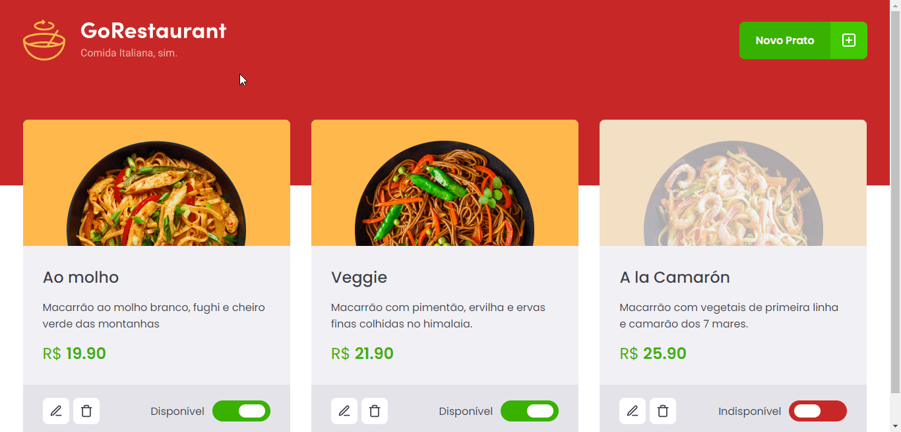
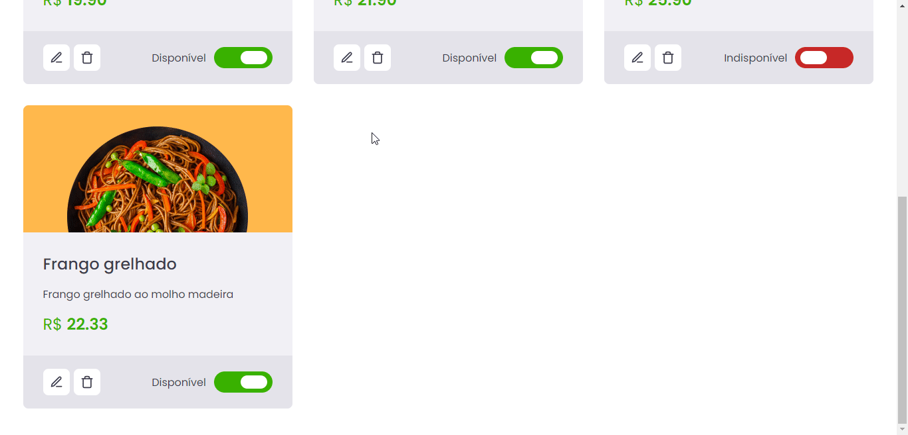

# GO RESTAURANT

<h1 align="center">
    
</h1>

[](./README.md)

## Índice

- [🧾 Sobre o projeto](#-sobre-o-projeto)
- [🚀 Principais tecnologias utilizadas](#-principais-tecnologias-utilizadas)
- [🔽 Como baixar o projeto](#-como-baixar-o-projeto)
- [💻 Como executar o projeto](#-como-executar-o-projeto)
- [👌 Como usar o app](#-como-usar-o-app)
  <br>

## 🧾 Sobre o projeto

GO RESTAURANT é uma aplicação feita com ReactJS. Um exemplo de painel administrativo para restaurantes italianos cadastrarem e editarem seus pratos (nome, descrição, preço e disponibilidade).
<br>

## 🚀 Principais tecnologias utilizadas

- [React](https://reactjs.org/)
- [Typescript](https://www.typescriptlang.org/)
- [Styled Components](https://styled-components.com/)
- [Axios](https://github.com/axios/axios)
- [JSON Server](https://github.com/typicode/json-server)

_(Você pode ver todas as dependências do projeto no arquivo [package.json](./package.json))_
<br>

## 🔽 Como baixar o projeto

```bash
$ git clone https://github.com/victorbadaro/ignite-challenge-gorestaurant
```

<br>

## 💻 Como executar o projeto

Os comandos abaixo usam o gerenciador de pacotes [yarn](https://yarnpkg.com/).

```bash
# 1. Instale as dependências do projeto
$ yarn

# 2. Execute a API do JSON Server
yarn server

# 3. Execute a aplicação
$ yarn start

# Você também pode gerar os arquivos para colocar a aplicação em produção com:
$ yarn build

# os arquivos estarão disponíveis na pasta dist/
```

Se tudo for executado corretamente, uma mensagem será apresentada no terminal informando que o código da aplicação foi compilado com sucesso:

```bash
Compiled successfully
```

Agora basta abrir o navegador e acessar: http://localhost:3000/

✅ Pronto! Se você seguiu corretamente os passos acima o projejto já estará sendo executado localmente em tua máquina.
<br>

## 👌 Como usar o app

- Para cadastrar um novo prato basta clicar no botão "Novo Prato" localizado no canto superior direito da página e preencher o formulário que será mostrado em tela:
  

- Para editar, deletar ou alterar a disponibilidade do prato:
  

<br>

---

<p align="center">Este projeto foi criado usando este <a href="https://github.com/rocketseat-education/ignite-template-reactjs-refactoring-classes-ts">template</a> e desenvolvido com ❤ por <a href="https://github.com/victorbadaro">Victor Badaró</a></p>
